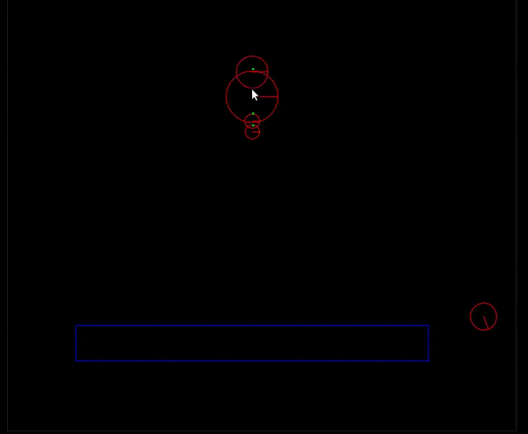

# LucidEngine
A basic physics2D engine for learning purposes. For a detailed explanation see my blog [here](https://deep110.github.io/posts/blogs/2019-01-13-implementing-2D-game-engine.html).




### Project Structure
The project is divided into two sections:
1. Physics Part
    * Like all physics engines, assumes all bodies are rigid bodies.
    * Right now all objects are instantiated as per required, not reusing the memory. But since
    it is just a demo I probably won't be fixing that.

2. Rendering Part
    * Handles the code for rendering collider shapes onto a window.
    * Contains a static camera and provides a scene interface like libGDX to interact with the physics world.
    * Code for handling inputs and game loop is provided by [Philip Diffenderfer](https://github.com/ClickerMonkey).

Both part can be used independently, but for demo purposes some code do overlap.


### Physics Explanation
Mainly simulation consists of three steps

1. Calculate colliding pairs of rigidbodies i.e NarrowPhase calculation
    
    * Usually game engines first use a process called BroadPhase calculation (by dividing world into regions) to narrow down the
     rigidbodies that may collide. But since our game world is not big, I am skipping that part for now.
    * Then we proceed to narrow phase calculation (actually determining which bodies are colliding). I have implemented using
    [Separating Axis Theorem](https://gamedevelopment.tutsplus.com/tutorials/collision-detection-using-the-separating-axis-theorem--gamedev-169).

2. Use Semi-implicit (Symplectic) euler to apply forces and change position
```
 v += (1/m * F) * dt
 x += v * dt
```

3. Then Impulse Resolution using momentum conservation
 * All collisions use coefficient of restitution (e) to calculate impulse.
   
   - For a pair of bodies equivalent coefficient is `min(e1, e2)`.
   - A body with infinite mass never move.

 * Takes translational force and rotational torque into account.
 
 * Takes static and dynamic friction
 
    - Each RigidBody has a material which has static friction and dynamic friction
     coefficients (F<sub>s</sub> and F<sub>d</sub>).
    - For a pair of bodies equivalent coefficients are calculated using:
      ```
        Fs = sqrt(Fs1 * Fs1 + Fs2 * Fs2)
        Fd = sqrt(Fd1 * Fd1 + Fd2 * Fd2)
      ```
      We can use average but using this gives better [results](https://gamedevelopment.tutsplus.com/tutorials/how-to-create-a-custom-2d-physics-engine-friction-scene-and-jump-table--gamedev-7756).
    - Finally final frictional impulse is calculated using [Coulomb's Law](https://en.wikipedia.org/wiki/Friction#Dry_friction)
      
      F<sub>f</sub> <= μF<sub>n</sub>
      
      Friction force is less than or equal to normal force on the surface multiplied by μ.
      Check is performed using static friction coefficient but value is taken to be of dynamic
      coefficient.

### TODO
1. Fix non balanced impulses
2. Add convex polygon for handling rotation properly
